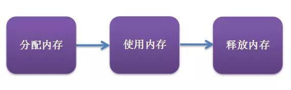
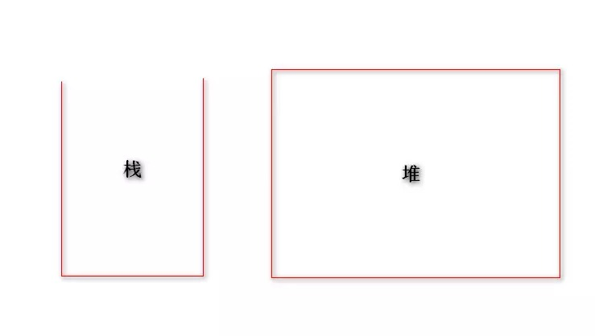

### 1.内存的生命周期


* 内存的分配：当我们生命变量、对象时候，系统会自动为他们分配内存。
* 内存的使用：即读写内存，也就是使用变量，对象等。
* 内存的销毁：使用完毕，由垃圾回收机制回收不在使用该内存。

### 2.内存的分类

* 栈：开口向上，先进后出，速度快，容量小。
* 堆：速队稍慢，容量大。

### 3.js中不同数据类型在内存中如何存储？
* [引用类型](/node/01base/dataType.md)存堆内存
* [基础类型](/node/01base/dataType.md)存栈内存
* 常量存池内存，池也被归类到堆中

### 4.js中不同数据类型的内存释放(垃圾回收)机制是怎样？
* [引用类型](/node/01base/dataType.md)(对象类型)在不被变量引用时会被V8的GC自动回收。
* [基础类型](/node/01base/dataType.md)如果在闭包的状态下，要等闭包没被引用了才会被GC回收，非闭包的情况下V8的新生代(new space)切换时会被GC回收。

### 5.GC(garbage collection)回收机制
* [引用计数垃圾收集](https://juejin.im/post/5d0706a6f265da1bc23f77a9#heading-7): 当一个象已经没有另一个对象引用指向他时，他会被回收。
* [标记清除算法](https://juejin.im/post/5d0706a6f265da1bc23f77a9#heading-8):从根部root出发(浏览器环境下为window，Node环境下global)依次梳理对象的引用，如果能从引用链找到，则标记为**可到达对象**，反之标记为**不可到达对象**，不可到达对象(即不被引用对象)会被V8回收。

### 6.如何避免内存泄漏

* 避免声明全局变量。
``` js
 var a = '全局声明' // 内存泄漏

 function fn() {
   b = '全局声明' // 内存泄漏
 }
```
* 尽量少编写复杂度高的闭包，得知道闭包了什么对象，在适当的时候释放引用了闭包的对象。
``` js
function fn() {
  var a = '局部声明'
  inner = function() {
    return a
  }
}
// 闭包inner引用了夫级fn函数中的变量，而inner是全局变量，a不会被GC回收，从而导致内存泄漏
```
* 绑定事件的时候，一定要在适当的时候取消绑定。编写一个类的时候，推荐用init函数对类的事件监听进行绑定与资源的申请，在destory函数对事件与资源的释放。
``` js
class Polygon {
  constructor(height, width) {
    this.height = height
    this.width = width
  }
  init() {
    this.data =  {
      area: this.height * this.width
      cycle: 2 * (this.height + this.width)
    }
  }
  destory() {
    this.data = null
  }
}

// 声明并初始化
const P1 = new Polygon().init()
// 销毁
P1.destoty()
```

[JS中的栈内存堆内存](https://juejin.im/post/5d116a9df265da1bb47d717b#heading-12)  
[JS中的内存释放](https://juejin.im/entry/5876018e128fe1006b4bda78)  
[JS中的内存管理](https://juejin.im/post/5d0706a6f265da1bc23f77a9#heading-8)  